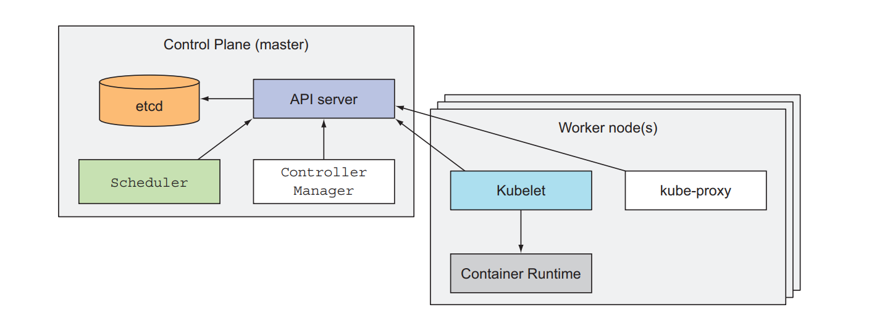
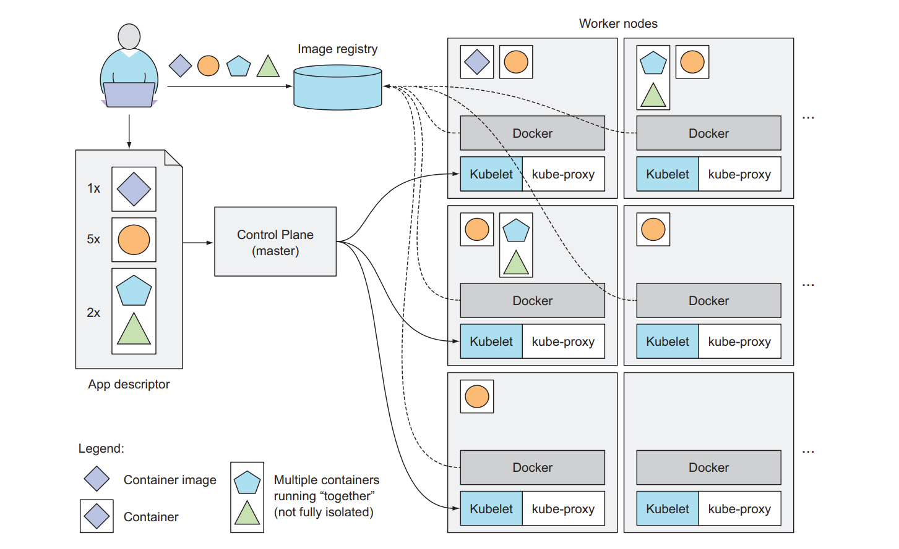

# Chapter 1: Introducing Kubernetes - Key Notes - Part 2

## Looking at Kubernetes

- **Kubernetes** is a software system that allows you to easily **deploy** and **manage** containerized applications on top of it.

- It relies on the features of **Linux containers** to run heterogeneous applications without:
  - Having to know any **internal details** of these applications
  - Having to **manually deploy** these applications on each host

- Deploying applications through Kubernetes is always the same, whether your cluster contains:
  - Only a **couple of nodes**
  - Or **thousands of them**
- The size of the cluster makes **no difference at all**.

## The Core Of Kubernetes

- The simplest view of the Kubernetes system is composed of:
  - A **master node**
  - Any number of **worker nodes**

- Developers can specify that certain apps must **run together**, and Kubernetes will deploy them on the same worker node.

- Other apps will be **spread around the cluster**, but they can talk to each other in the same way, regardless of where they're deployed.

> 🧠 Kubernetes handles the complexities of distributing applications across a cluster while maintaining their ability to communicate effectively.

## Helping Developers Focus On Core App Features

- Kubernetes can be thought of as an **operating system for the cluster**.

- It relieves application developers from having to implement certain **infrastructure-related services** into their apps.

- Instead, they can rely on Kubernetes to provide these services:
  - **Service discovery**
  - **Scaling**
  - **Load-balancing**
  - **Self-healing**
  - **Leader election**

> 🚀 By abstracting away infrastructure concerns, Kubernetes allows developers to concentrate on building features that deliver actual business value.

## Helping OPS Team Achieve Better Resource Utilization

- Kubernetes will run your containerized app somewhere in the cluster, provide information to its components on how to find each other, and keep all of them running.

- It **optimizes infrastructure usage** by:
  - **Automatically placing** containers based on their resource requirements
  - **Fitting multiple components** on the same node while respecting resource constraints
  - **Redistributing containers** when nodes fail or run out of resources

- Kubernetes **maximizes hardware utilization** through:
  - **Bin-packing algorithms** that optimally distribute workloads
  - **Resource quota enforcement** to prevent overconsumption
  - **Dynamic scaling** of application instances based on actual load

- From an operations perspective, Kubernetes:
  - **Reduces idle resources** by consolidating workloads
  - **Simplifies capacity planning** through automatic workload distribution
  - **Increases fault tolerance** without manual intervention

> 💻 With Kubernetes, infrastructure teams can focus on managing the cluster itself rather than worrying about application placement and recovery procedures.

## Understanding The Architecture Of Kubernetes

- The master node, which hosts the Kubernetes Control Plane that controls and manages the whole Kubernetes system
- Worker nodes that run the actual applications you deploy

### The Control Plane Components

- The **Control Plane** (master) is responsible for:
  - **Managing the cluster state**
  - **Scheduling applications**
  - **Scaling applications**
  - **Rolling out changes**

- Key components of the Control Plane include:
  - **API Server**: The front-end interface to the control plane
  - **etcd**: A distributed key-value store that stores all cluster data
  - **Scheduler**: Assigns workloads to nodes based on resource requirements
  - **Controller Manager**: Runs controller processes that regulate cluster state
  - **Cloud Controller Manager**: Integrates with underlying cloud provider APIs

### Worker Node Components

- **Worker nodes** (previously called minions) have the following components:
  - **Kubelet**: An agent that ensures containers are running in a Pod
  - **Container Runtime**: Software responsible for running containers (Docker, containerd, etc.)
  - **Kube-proxy**: A network proxy that maintains network rules on nodes

- Worker nodes are where:
  - **Application Pods** are scheduled to run
  - **Container images** are stored and executed
  - **Volume attachments** occur for persistent storage

### Communication Flow

- All administrative commands go through the **API server**
- The **API server** validates and processes requests, storing the resulting state in **etcd**
- The **Scheduler** watches for new workloads and assigns them to appropriate nodes
- **Kubelets** on each node communicate with the API server to:
  - Receive work assignments
  - Report node and Pod status
  - Execute container operations

> 🔄 This architecture enables Kubernetes to maintain a clear separation between the system that decides what to run (Control Plane) and the systems that actually run the workload (Worker Nodes).

### The Application Deployment Process

- To run an application in Kubernetes, you must follow these steps:
  1. **Package** your application into container images
  2. **Push** these images to an image registry
  3. **Submit** a description of your app to the Kubernetes API server

- The **application description** includes critical information:
  - Which **container images** contain your application components
  - How these components are **related to each other**
  - Which components need to be **co-located** (run on the same node)
  - How many **replicas** of each component should run
  - Which components should be **exposed as services** to internal or external clients

- When the **API server** processes your application description:
  1. The **Scheduler** assigns container groups to appropriate worker nodes based on:
     - **Resource requirements** of each container group
     - **Available resources** on each worker node
  2. The **Kubelet** on the selected nodes instructs the **Container Runtime** to:
     - Pull the required container images
     - Run the specified containers

- Container organization in Kubernetes follows these principles:
  - Containers are grouped into **pods** (the basic deployment units)
  - A pod can contain **one or more containers**
  - Multi-container pods run **co-located containers** that shouldn't be isolated
  - You specify the desired number of **replicas** for each pod
  - Kubernetes distributes pod replicas across available worker nodes

> 📦 Pods are the smallest deployable units in Kubernetes—not individual containers. A pod is a group of one or more containers that are always co-located, co-scheduled, and run in a shared context.
> 🔄 This deployment model gives Kubernetes tremendous flexibility in managing applications while maintaining necessary relationships between components.

### Kubernetes-specific application modifications

- While Kubernetes can run almost any containerized application, applications that are **"Kubernetes-native"** benefit from:
  - **Health checking** mechanisms
  - **Graceful shutdown** handling
  - **Configuration** through environment variables or config maps
  - **Statelessness** or proper persistent storage usage
  - **Automatic Scaling**

- Applications should be designed to:
  - **Handle temporary failures** without losing data
  - **Store persistent data** separately from application containers
  - **Expose metrics** for monitoring and autoscaling
  - **Log to standard output/error** for centralized logging

> 🛠️ The best applications for Kubernetes embrace microservices architecture, statelessness, and cloud-native principles to fully leverage its capabilities.
